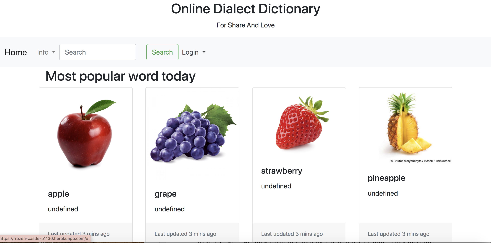

Final Project #
## Team He ##
## Application: Dialect Dictionary ##
## Spring 2020 ##
## Overview ##
Our application is a platform that aims to share the knowledge and charm of different dialects to the world. The application allows users to record their own dialect as well as learn dialects from others. According to our design, all words in different dialects will refer to the same object which is connected by one unique image of that object. This way, the users can easily understand the words and have a connection without knowledge on any standard languages. The purpose of this platform is to protect the historic heritage of dialects which are facing the challenge of extinction nowadays. We will solve this problem by providing a convenient and straightforward way for users to share and learn them. We hope that this platform can also be a compliment for traditional dictionaries, which normally have the data for standard languages only. The application will allow users to upload an image, the spelling, the standard language, pronunciation, and location of the word.  
## Team Members##
Zipei Jiang github: zipeijiang

Haoqin Liang github: Leonalhq & Leonalhqkun

Addis Gunst github: AddieGunst

## User Interface ##
### 1.Homepage

Homepage with user mode and client mode, user can post the word. And get the pronunciation by click the img.

### 2.Word

Allows users pass word spelling and image url to the database, and definition with corresponding language as optional parameter. If success, the program adds a word object to the database, and if there are definitions passed in, it also creates a definition object. The program prints the word and image to the website if the action is succeed, or print erro if the insertion fails.
User also can browse the word they create and delete them

### 3.UploadPronunciation

Above are the framework and screenshot of the word page for our project. Each image in our dataset corresponds to one unique word page. This page consists of three parts: the navigation bar is the same as other pages. The left-hand side contains the word definition for the image in various languages that users are able to select.  And users are allowed to update definitions on languages either existing or not. The right-hand side is the pronunciation of the word that describes the image in different dialects uploaded by users. By clicking the speaker button, users can listen to those pronunciations. And by clicking the line for uploaders' locations, users can find where the dialect comes from through the map. 

## API ##
### Main
#### /mainview
    Retrieve words from database
    Parameters: none

#### /getDefinitionByLanguage & /word/getDefinitionByLanguage
    Retrieve the definition of a word in certain language
    Parameters: word(spelling of the word), language

### USER
#### /siginup      	
	Allows new users to sign up
	Parameters: id(user id), name(user name), password(user password), portrait, location

#### /login         	
	Allows users to login their account
	Parameters: id(user id), password(user password)

#### /changeinfo
    Allows users to change their information
	Parameters: id(user id), name(user name), password(user password), portrait, location

#### /getuserinfo
    Retrieves the user information
    Parameters: user id
    

### WORD
#### /word/new
    Allows a word to be added to the database, creates a new word object.
    Parameters: name(spelling in English), img(url to the image), languages(languages to describe the word), definition(description to the word)

#### /word/definition
    Allows users to add/modify definitions of the word by update the definition of the word
    Parameters: word(word for definition), languages(language of the description), def(string of descriptions)

#### /word/delete
    Delete the word from the database
    Parameter: word(word to delete)
#### /word/view
    Return the word, the imge of the word, the list of languages for definition
    Parameter: word(spelling of the word in English)

#### /word/viewuser
    Get the information of the user
    Parameter: id(user id)

### Comment
#### /word/addcomment
    Add comment to a pronunciation
    Parameters: pronunID(Id of the pronunciation), user(uploader), text(text of the comment)
#### /word/getcomment
    Get all comments of a pronunciation
    Parameters: pronunID(Id of the pronunciation)
#### /word/delcomment
    Delete a comment of a pronunciation
    Parameters: ID (Id of the comment)
#### /word/comment
    Create a comment object that allows users to comment on the pronunciation they chose
    Parameters: userID(ID of the user), proID(ID of the pronunciation), comment(string)

### PRONUNCIATION
#### /word/pronunciation
    Create a pronunciation object that allows users to add new pronunciations to a word
    Parameters: word(word for pronunciation), pron(audio file of pronunciation), location(dialect location)

#### /word/delpronunciation
    Delete the pronunciation with given ID from the database
    Parameters: ID(pronunciation ID to delete)

#### /word/getpronunciation
    Return the list of pronunciations of a word
    Parameters: word(spelling of the word)

#### /word/addPronunLikes
    Increase the number of likes by 1 to the word
    Parameters: pronID(Id of the pronunciation)

## Database ##
#### UserInfo Table
    key             value type              description
    ID              string                  the unique ID of user, primary key
    username        string                  the name of the user
    portrait        string                  the source url of the user’s portrait image
    registered_at   time                    the date the user registered
    location        string                  the address string of the user
    password        string                  the password of the user

#### UserWord Table
    key             value type              description
    ID              string                  the unique ID of user, primary key
    word            string                  the word the user creates

#### Word Table
    key              value type             description
    word             string                 the spelling of the word in English, primary key
    img              string                 the source url of the image describes the word
    languages        array[string]          the list of languages with descriptions to the word
    view             number                 counts how many times the word is viewed

#### Definition Table - there exists multiple definition table corresponds to different languages
    key             value type              description
    word		    string			        word the definiition decribes, foreign key references wordTable(word)
    definition      string                  the of defintion of the word in certain language

#### Pronunciation Table
    key                 value type                  description
    ID                  int                         the unique randomly generated ID, primary key
    word                string                      the spelling of the word the pronunciation descripes, foreign key references wordTable(word)
    pronunciation       audio                       the audio file of the pronunciation
    address             string                      the address string of the location the dialect comes from
    userID              int                         the user ID of the creator
    likes               int                         the number of likes the pronunciation receives

#### Comment Table
    key     	   	value type         	description
    ID              int                 the unique id of each comment, primary key
    proID           int                 the ID of the pronunciation of the comment, foreign key references pronunciationTable(ID)
    creatorID    	int                 the user ID of the creator user
    text           	string              the comment added by the user
    date           	time                the time the comment is added

    ### End Points

## URL Routes ##
### https://frozen-castle-51130.herokuapp.com/
    The main page of the website. Allows users to sign up/log in. Provide information about words that users can visit.

### https://frozen-castle-51130.herokuapp.com/word.html?
    The page allows users to update words and definition. And allows registered users to modify and delete words.

### https://frozen-castle-51130.herokuapp.com/wordPage.html?
    The page contains all information about a word object. Allows users to view all definitions and supported languages of the word. Allows users to add new definitions to the word. Retrieves all pronunciations of the word, and for each pronunciations, users can view/add comments, and add likes to it. Allows users to delete pronunciations from a word.

### https://frozen-castle-51130.herokuapp.com/upload.html
    The page allow users to add pronunciations by passing address of the audio, the word and the location.
    
## Authentication/Authorization ##
    User need to login in the main page to see the delete word and browse word options.
    After login, GET carry user login to the word page, in the login mode, when user post new word it will
    update the worduser table so they can retreive the word they post by themself. User can find what word they 
    post in the login mode.

## Division of Labor ##

Addis Gunst: HTML and CSS for the page for users to submit data. Front-end and back-end coding (ts, HTML) on pronunciation CRUD. Implemented back-end functions for APIs: addpronunciation, getpronunciation, addPronunLikes, deletePronun. Implemented front-end functions to add pronunciation in upload.html, add likes to pronunciation and delete pronunciation in wordPage.html

Zipei Jiang: HTML and CSS for the page for users to view data of each words.  Building the basic skeleton of the database and server, front-end and back-end (ts, HTML) coding on definition CRUD. Implemented back-end functions for APIs: addcomment, delcomment, getcomment. Implemented front-end functions to load word/pronunciation information to wordPage.html, functions to retrieve/add definitions to word in wordPage.html, functions to get/add comments.

Haoqin Liang: HTML and CSS for the homepage of the website and the navigation bar of the website. Front-end and back-end coding (ts, HTML) on word CRUD. Heroku deployment,CRUD pronu and modify.  Implemented back-end functions for APIs: signup, login, changeinfo, mainview. Implemented all front-end functions for user sign in and sign up. Implemented the front-end html for main page.

## Conclusion ##
The team found that the design and implementation process was challenging but doable. We learned a lot through the design and implementation process because most of us had no experience in html, css, javascript, and typescript. We had experience in database queries because we took Compsci 345 but did not know how to integrate a SQL database to our backend. The in-class exercises were very helpful starters to implement our PCRUD server and SQL database queries. Some challenges we faced were deploying everything on Heroku and getting our server to connect up with our data model with the user interface.  

