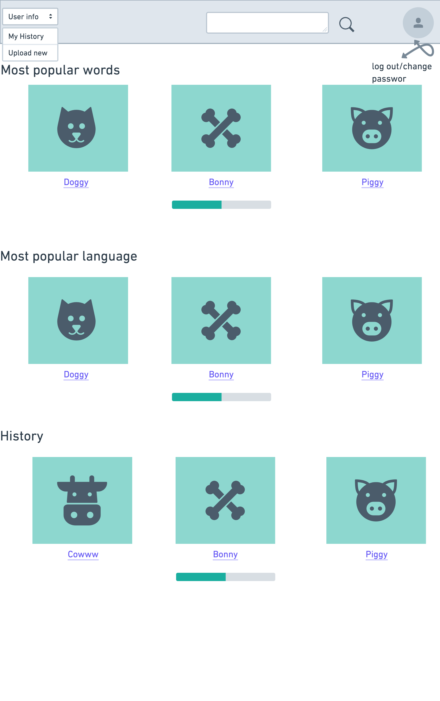
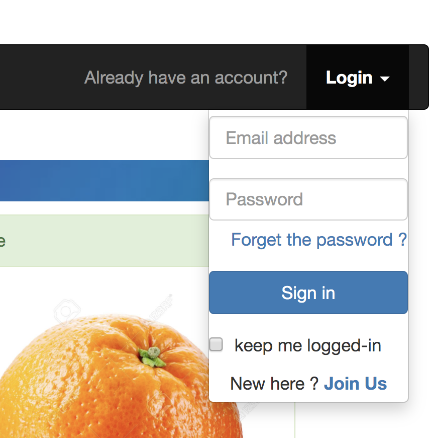
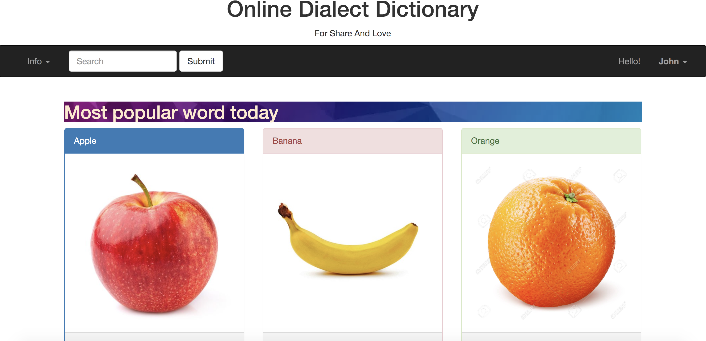
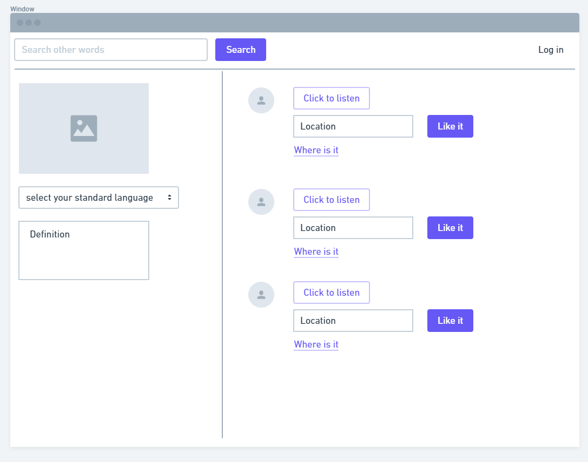
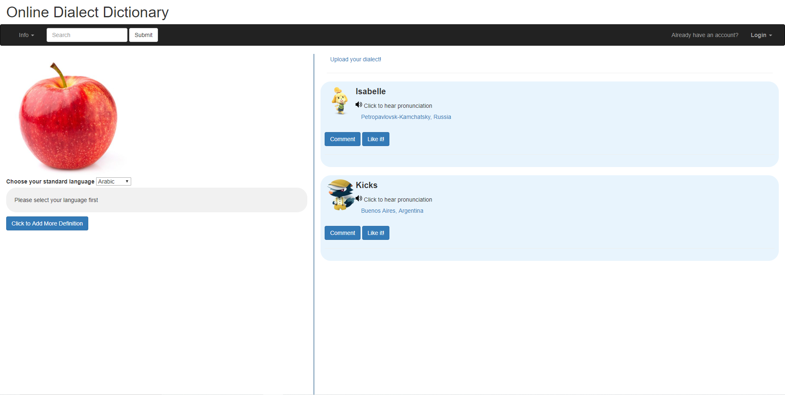

# Project Milestone 1 Assignment #
## Team He ##
## Application: Dialect Dictionary ##
## Team Overview ##
Zipei Jiang github: zipeijiang

Haoqin Liang github: Leonalhq

Addis Gunst github: AddieGunst
## Innovative Idea ##
Our application is a platform that aims to share the knowledge and charm of different dialects to the world.  
The application allows users to record their own dialect as well as learn dialects from others.  
According to our design, all words in different dialects will refer to the same object which is connected by one unique image of that object. This way, the users can easily understand the words and have a connection without knowledge on any standard languages.   
The purpose of this platform is to protect the historic heritage of dialects which are facing the challenge of extinction nowadays. We will solve this problem by providing a convenient and straightforward way for users to share and learn them. We hope that this platform can also be a compliment for traditional dictionaries, which normally have the data for standard languages only.  
The application will use google map to identify the location of users, which is uploaded by users themselves, to indicate where the dialect comes from. The application will also use a standard language dictionary, such as google translation, to connect dialects with the definitions in their corresponding words on standard languages.   
## Important Components ##
### 1. Have accounts for users
In order to help regulate the origin of users' dialects, a first-time upload dialect user will be asked to create an account. While guests won't require an account to access the content, they can have their own accounts to memorize the dialect they've seen.  

### 2. Specific fields for users when uploading data.
When the user uploads a word that has not already appeared in the database, they will be asked to upload an image of the object that represents that word, a video file for the pronunciation, the spelling (optional), and the city the user lives in through google maps. If the user wants to upload a word describing an object where an image of that object already exists in the database, they will fill out the necessary information as described previously, except they will not upload an image. Another function of the application allows users to upload the word that describes the image on standard language, and this description is allowed to be modified by any users for accuracy.

### 3."Favorite" button and comment function.
There will be functions that allow user interaction: users can "like" the word uploaded by other users just like Twitter, and if necessary, they can comment on the word.

### 4.Search function
The application allows searching on standard languages, on dialects if the user knows the spelling, and on the location (city, province or state, country) if users want to learn the dialect in certain places.

## Wireframes ##
###1.Homepage

In the homepage, There are two mode: guest and sign in mode

In the guest mode, user can browse and search any word they want. Dialect has been categorized by 3 types: the most popular word, the most popular language and the user history.

However, user must sign in to see the history.

In the sign in mode, user can upload new word, check his history and sign in or sign out.

###2.Upload & Content

Above are the framework and screenshot of the word page for our project. Each image in our dataset corresponds to one unique word page. This page consists of three parts: the navigation bar is the same as other pages. The left-hand side contains the word definition for the image in various languages that users are able to select.  And users are allowed to update definitions on languages either existing or not. The right-hand side is the pronunciation of the word describes the image in different dialects uploaded by users. By clicking the speaker button, users can listen to those pronunciations. And by clicking the line for uploaders' locations, users can find where the dialect comes from through the map. 
